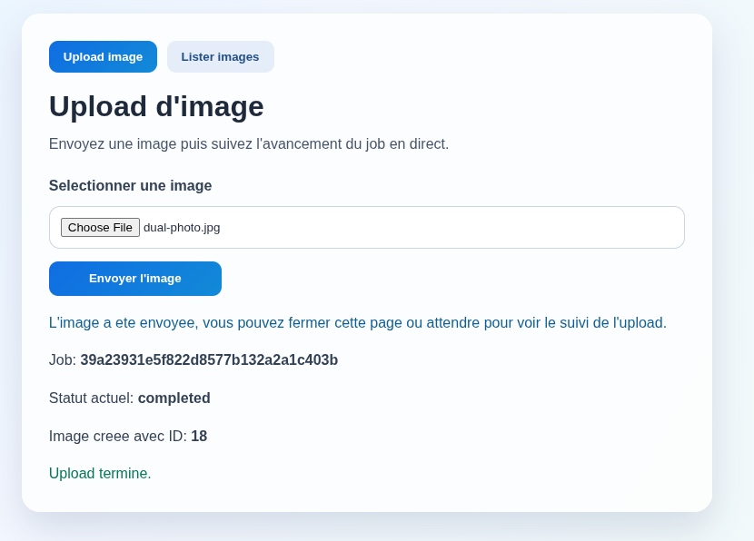
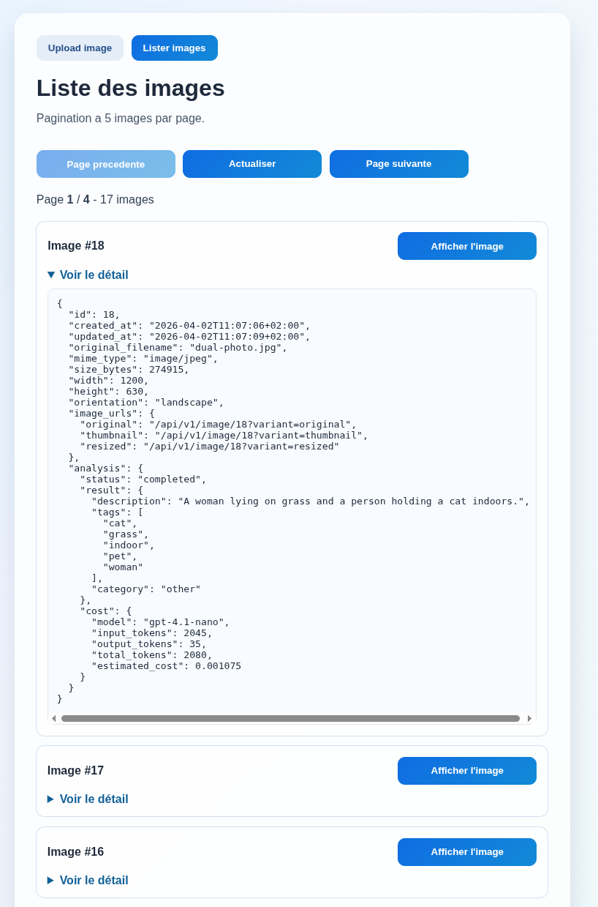

# Frontend (Vue + Vite)

> This frontend is intentionally minimal and focuses on demonstrating secure API consumption through a backend-for-frontend (BFF) layer.

A minimal frontend interface designed to consume the local backend (BFF) without exposing API credentials or authentication logic in the browser.

## Technical Stack

- Vue 3 (`<script setup>`, Composition API)
- Vite 5
- TypeScript
- Vue Router 4 (`/upload`, `/list`)
- HTML/CSS without external UI framework
- Native HTTP calls using `fetch`
- `AbortController`-based request cancellation via reusable composables

## Run (Docker Compose)

From the project root:

```bash
cp .env.example .env
docker compose up -d --build
```

Access:
- Frontend: `http://localhost:5173`
- Backend (BFF): `http://localhost:3000`

## Features

The UI focuses on demonstrating typical API consumption patterns:
- file upload with asynchronous processing
- polling for background job status
- paginated data retrieval
- on-demand resource loading
- request concurrency safety (cancel previous request, keep latest active request)

### 1) Image Upload

Upload is handled via the BFF, which forwards the request to the API and manages authentication transparently.

- Select an image file from the UI.
- Send it to the backend (`POST /images`).
- Display upload job status with debounced polling (`300ms`) and timeout protection (`30s` per status call).
- If multiple uploads are triggered quickly, previous in-flight upload/polling requests are canceled and replaced by the latest one.
- Current upload size limit: `2 MB` (PHP runtime constraint on the API side).
- User messages:
  - confirmation after upload starts,
  - `Upload complete.` on success,
  - explicit error messages (for example: file too large).



### 2) List Images

Data is fetched through the BFF, ensuring no direct API access from the browser.

- Paginated image listing.
- Pagination is set to `5` images per page
- Navigation buttons.
- Per-row JSON display with collapsible details.
- `Show image` button to open a modal with on-demand loading.
- Concurrent fetches are canceled on page/image changes to avoid stale UI updates.


